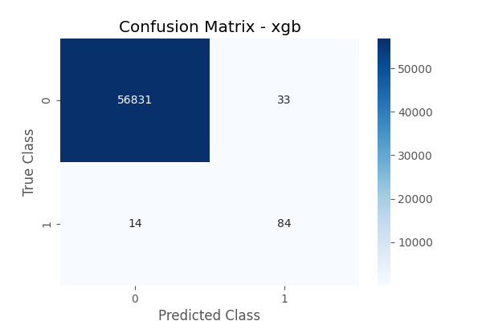
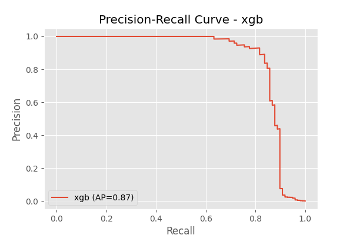

# 💳 Credit Card Fraud Detection


## 📌 Project Overview
This project implements an end-to-end Machine Learning pipeline to detect fraudulent credit card transactions. The dataset is highly imbalanced, with positive class (frauds) accounting for only **0.172%** of all transactions.

Key techniques used:
- **SMOTE (Synthetic Minority Over-sampling Technique)** to handle class imbalance.
- **Stratified K-Fold Validation** to ensure reliable performance metrics.
- **XGBoost, Random Forest, and Logistic Regression** models.

## 📊 Key Results
The model was optimized to maximize **Precision-Recall (AUPRC)** rather than simple accuracy.

| Model | ROC-AUC | PR-AUC (Average Precision) |
| :--- | :--- | :--- |
| **XGBoost** | **0.98** | **0.87** |
| Random Forest | 0.97 | 0.86 |
| Logistic Regression | 0.97 | 0.72 |

## 📈 Visualizations

### Confusion Matrix (XGBoost)


### Precision-Recall Curve (XGBoost)


## 🛠️ Installation & Usage

1. **Clone the repo:**
   ```bash
   git clone https://github.com/ShivrudraSwami/Credit-Card-Fraud.git
   cd Credit-Card-Fraud